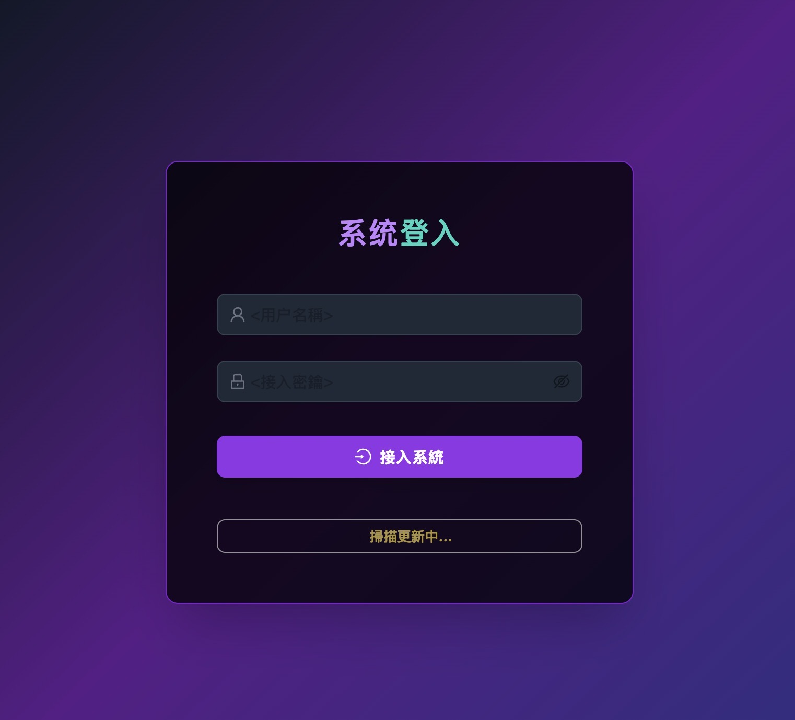
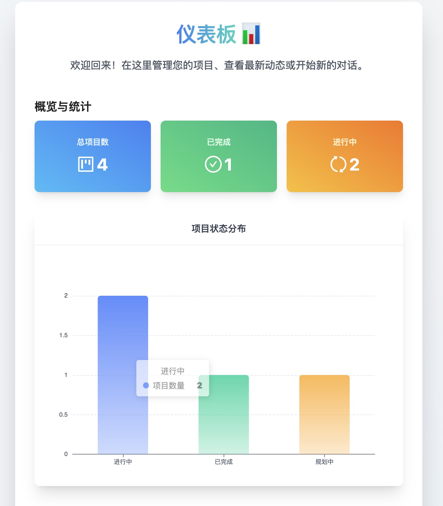
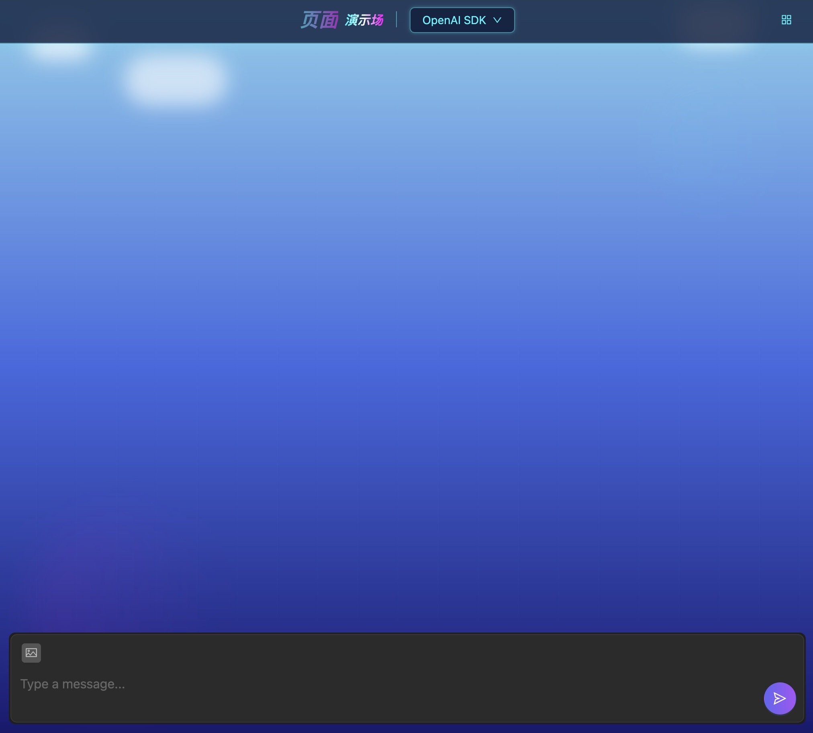
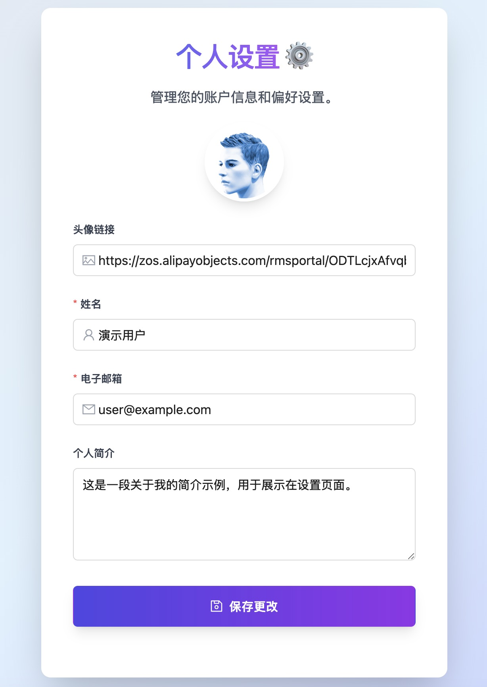

# electron-ai-agent2pages

ai生成页面桌面应用 技术栈：electron+react+openai+echarts+tailwindcss+。。。
功能： 登录+看板+个人信息+实时聊天生成项目；
待开发：【完善langchain,ercel-ai,llamaindex】

(./images/kanban2.jpg)
(./images/liaotian2.jpg)

